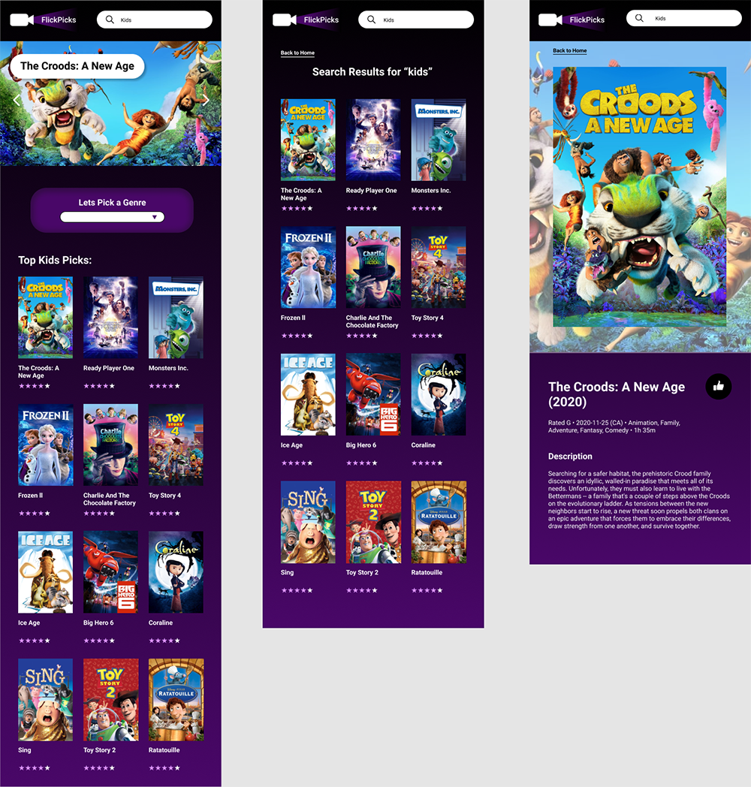

# FlickPicks

## Description

FlickPicks is an application that connects to The Movie DB through an API key. The application allows users to sort through different genre's to be able to see the top movies currently in each genre. Users can also search for specific movies and once located can click on the poster to see all the details about that specific movie.

## Wireframes


## Mockups



## Installation

Make sure to locate the folder in the command line. Once there, follow the instructions below to get the app started:

```
cd ios
pod install
cd ..
npm install
npm run ios
```

Once you've completed the steps in your terminal, you'll need to wait until the app has been fully built in the xcode simulator. Once it has been built it should be good to go!

## Technologies Used

React Native

## API's Used

The Movie DB API Key

## Contributers Used

[Amy Karpiak](https://github.com/amykarpiak)
[Jenna Emerman](https://github.com/jenna-mae)

